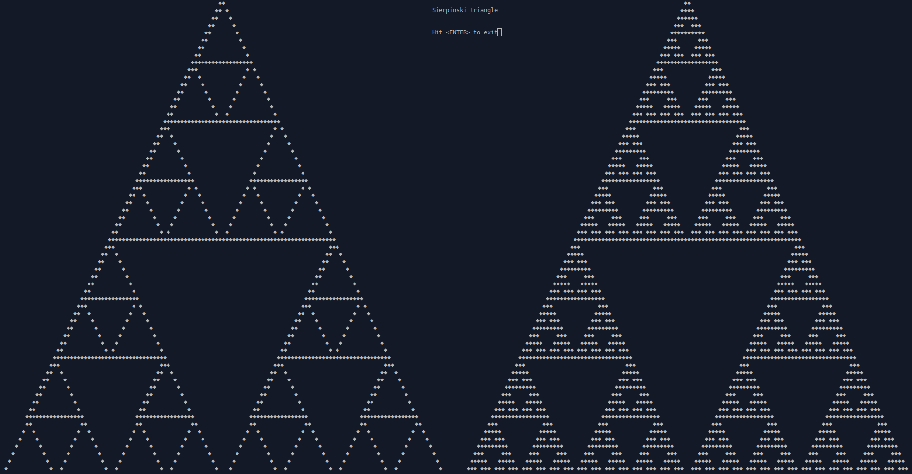
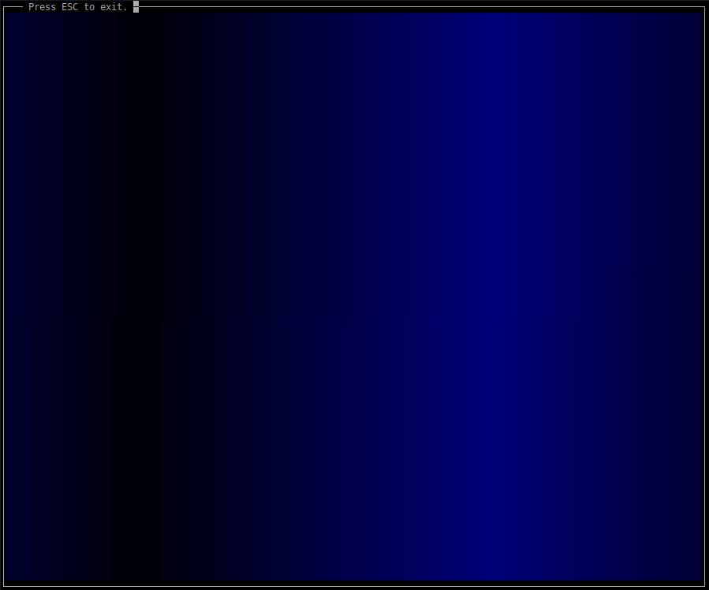
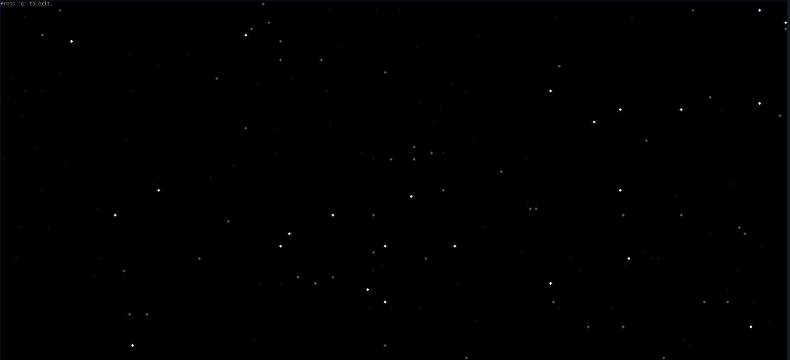
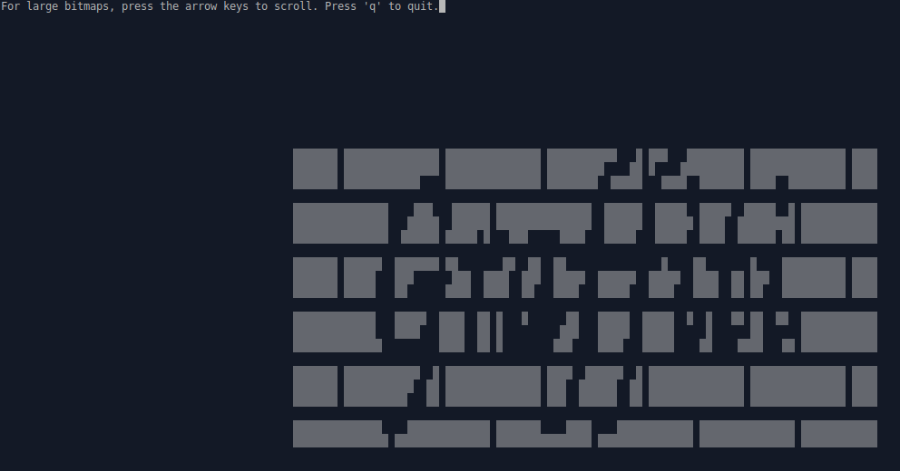

# ncurses
Graphics programming for the console using the [ncurses](https://en.wikipedia.org/wiki/Ncurses) library.

These example are all written in C. They have to be linked against libncurses 'gcc -lncurses' to compile. Also a few GNU extensions are used but the main part is ANSI-C99.

libncuses can be installed from the system package manager. These examples were created and tested with libncurses5. If you look for the latest version you can find the ncurses page [here](https://invisible-island.net/ncurses/).

With ncurses you can develop text user interface (TUI) programs for the console. A famous example of such a program is the file manager [Midnight Commander](https://en.wikipedia.org/wiki/Midnight_Commander).

## Sierpinski

First example of using ncurses. Draws a Sierpinski triangle on the console using recursion. It also implements a simple line-drawing algorithm.

## Colorscroll

Next, an animated color gradient moving horizontally is created by just manipulating the color values of the console. The character positions are never changed.

## Starfield

This classic example shows a scroll effect on different layers. The animation speed is dynamically adjusted based on precise time measurements to reach the target frames-per-second (FPS) count.

### Xbmview - X BitMap (XBM) viewer

This is a program to load and display a XBM bitmap file passed-in as a program parameter. It allows to move over the bitmap using the arrow keys if the bitmap is to large to fit on the screen.

[XBM](https://en.wikipedia.org/wiki/X_BitMap) is a very simple bitmap file format. The bitmap data is represented as a C array in the file so it can also be included directly in the source. Each bit of the bitmap data represents a single pixel. If the bit is set, the pixel is painted otherwise it's skipped.

The test folder contains some example bitmaps. They were created with the [mtPaint](http://mtpaint.sourceforge.net) graphic editor. A big database of XBM files can be found in the [Picons Archive](http://kinzler.com/ftp/faces/picons/).

About the XBM format: if the width of the bitmap is not a multiple of 8, the remaining bits of the current byte are skipped. The next byte then contains the first bits of the next row if any. Thus, a 3x3 and a 7x3 bitmap, for example, require both 3 bytes. A 9x5 bitmap already requires 10 bytes, because the last byte in each row stores only one bit of information.
